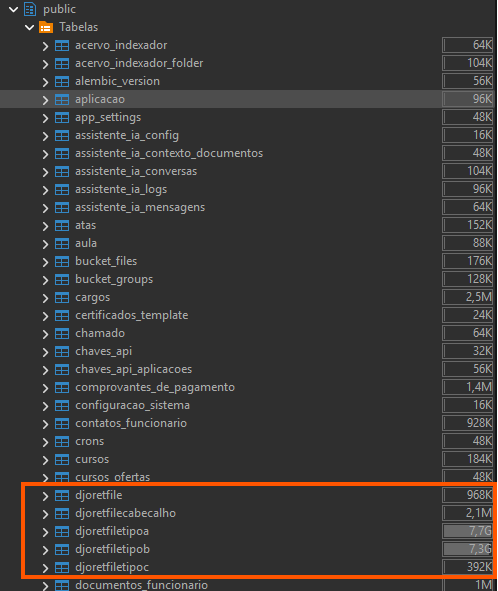
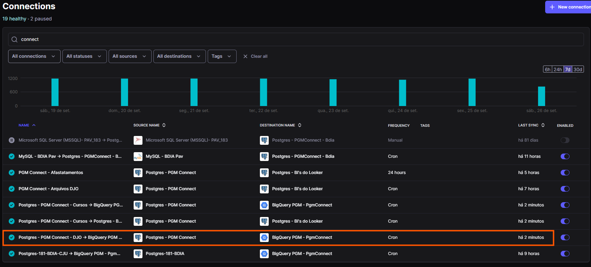
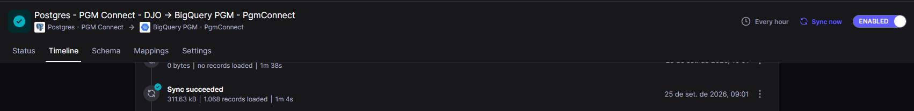
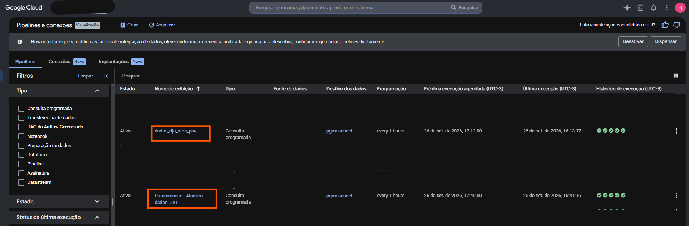
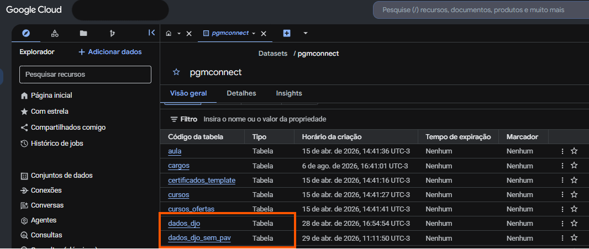
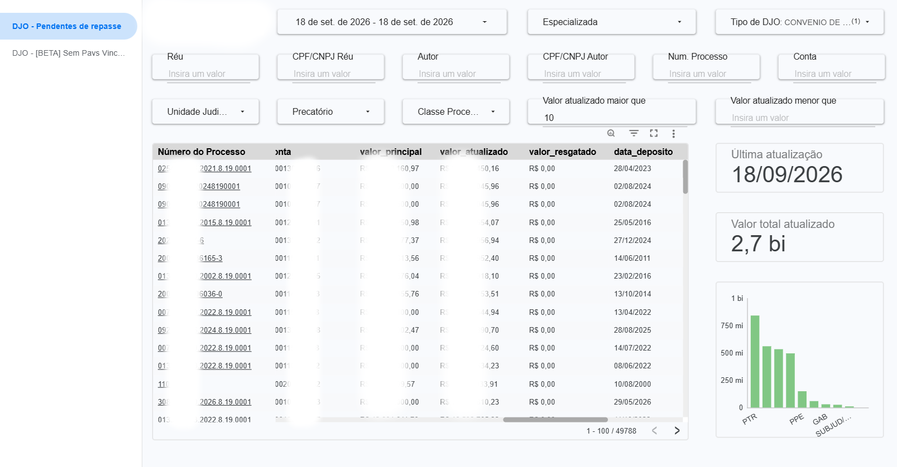
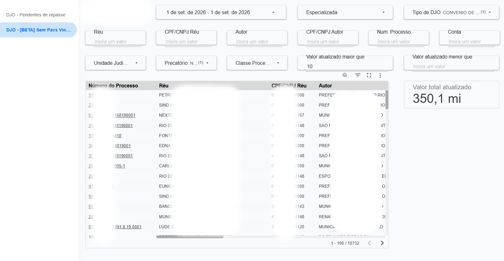
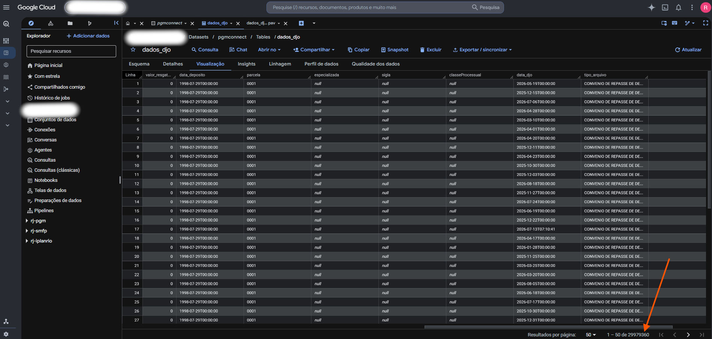
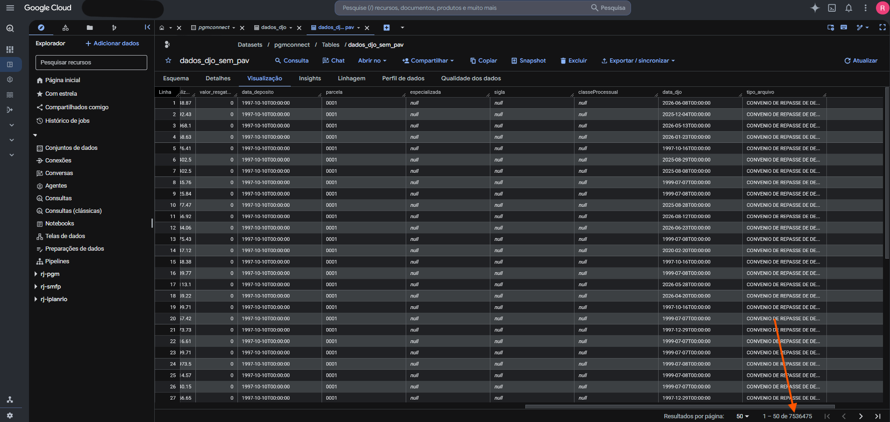

## 1. Contexto de Negócio e Perguntas (Etapa 2 e 4.1)

### Contexto

A Procuradoria Geral do Município do Rio de Janeiro acompanha diariamente, via scraping automatizado do Banco do Brasil, os depósitos judiciais vinculados a processos em que o Município é parte. Diariamente, às 8h, são baixados 5 arquivos do BB, cada um representando um tipo de movimentação financeira relacionada a esses depósitos. Os dados passam por uma API (FastAPI) que identifica, trata e armazena as informações no banco PostgreSQL do sistema **PGMConnect**, e também são importados no ERP jurídico **PAV**. Em seguida, o Airbyte replica essas tabelas para o BigQuery, onde uma pipeline agendada geram duas tabelas consolidadas, otimizada para consulta, que alimenta um BI (Looker Studio/Data Studio) usado pelos gestores.

Até hoje, esse BI é majoritariamente operacional (foto do dia). Este MVP organiza e documenta essa pipeline segundo os princípios de Engenharia de Dados (arquitetura em camadas, catálogo, qualidade), e aprofunda a análise histórica desses dados — algo que o BI evolutivo atual pouco explora.

### Problema

Consolidar e monitorar a posição financeira da Procuradoria referente a valores a receber, a pagar e o saldo acumulado de depósitos judiciais na conta vinculada ao Banco do Brasil, garantindo que todos os depósitos estejam corretamente vinculados a um processo no sistema PAV.

### Perguntas de negócio

1 — Saldo diário consolidado (a receber − a pagar)
2 — Volume médio e valor diário de Depósitos Acolhidos
3 — Processos sem vínculo PAV: quantidade e impacto financeiro

### Dados brutos: origem e estrutura

Os dados têm origem no extrato diário do Banco do Brasil, obtido via scraping automatizado e classificados em 4 tipos de movimentação (um 5º arquivo, o snapshot/extrato consolidado, é descartado do pipeline analítico por ser redundante em relação aos demais):

| Código `tipo_arquivo` | Nome oficial (BB)                              | Significado no negócio                                 |
| --------------------- | ---------------------------------------------- | ------------------------------------------------------ |
| 1                     | Convênio de Repasse de Depósitos - Lei Federal | Depósitos acumulados, aguardando resolução do processo |
| 2                     | Resgates Contra o Governo                      | Valores a pagar — o Município perdeu a causa           |
| 3                     | Depósitos Acolhidos                            | Novo depósito judicial recebido no dia                 |
| 4                     | Resgates a Favor do Governo                    | Valores a receber — o Município ganhou a causa         |

Após passar pela FastAPI e serem armazenados no PGMConnect (Postgres), os dados chegam ao BigQuery para serem estruturados em duas tabelas principais:

- **`dados_djo`**: dimensão completa de processos identificados no Diário da Justiça Oficial, com as partes envolvidas.
- **`dados_djo_sem_pav`**: subconjunto de `dados_djo` referente aos registros **sem vínculo** com número de processo no sistema PAV, já com os valores financeiros do depósito judicial.

### Licença de uso dos dados

Dados administrativos de órgão público municipal, sujeitos à Lei de Acesso à Informação (LAI) e à LGPD. Campos de identificação pessoal (`autor`, `cpf_cnpj_autor`, `reu`, `cpf_cnpj_reu`) são anonimizados antes de qualquer publicação externa — método de anonimização documentado na seção 5 (Qualidade de Dados). Prints do BI usados como evidência neste documento têm essas colunas ocultadas/borradas.

---

## 2. Carga dos Dados (Etapa 4.2)

O processo de coleta e carga acontece em múltiplas etapas:

1. **Scraping diário (8h)**: robô acessa o portal do Banco do Brasil e baixa 5 arquivos, um por tipo de movimentação e move para um diretório especifico para serem importados pelo ERP.
2. **Processamento via API (FastAPI)**: os arquivos são enviados a uma API que identifica o tipo de arquivo, realiza o primeiro tratamento (parsing, tipagem) e grava os dados no banco PostgreSQL do sistema PGMConnect.
3. **Replicação para a nuvem (Airbyte)**: A cada hora o Airbyte replica as tabelas do PGMConnect (Postgres) para o BigQuery, mantendo uma cópia incremental atualizada.
4. **Transformação agendada no BigQuery**: uma consulta agendada (scheduled query) processa as réplicas do PGMConnect e gera a tabela final (`dados_djo_sem_pav` + `dados_djo`), com estrutura otimizada para consulta, dado o volume (~7GB).

Essa etapa 2 (tratamento na FastAPI, antes mesmo da chegada ao BigQuery) é o motivo pelo qual grande parte da limpeza/padronização já acontece fora do BigQuery — isso é abordado com mais detalhe na Qualidade de Dados (seção 5).

Referência aos scripts:
[Backend FastApi](./fastapi/) - [WebScrapping](./scraping/) - [Consultas Agendadas BQ](./bigquery/sql/)

**Evidência (screenshot):**







---

## 3. Modelagem e Catálogo de Dados (Etapa 4.3)

### Modelo adotado

Esquema Estrela simplificado: uma tabela fato de movimentações judiciais, uma dimensão de processo e uma dimensão categórica de tipo de movimentação.

- **`fato_deposito_judicial`** (baseada em `dados_djo_sem_pav`)
- **`dim_processo`** (baseada em `dados_djo`)
- **`dim_tipo_movimentacao`** (derivada da coluna `tipo_arquivo`)

### Catálogo de Dados

#### Tabela `dados_djo` (dimensão de processos)

| Campo                | Tipo       | Modo       | Descrição                               | Domínio / Observações                   |
| :------------------- | :--------- | :--------- | :-------------------------------------- | :-------------------------------------- |
| `id`                 | `INTEGER`  | `NULLABLE` | Identificador único do registo          | Chave primária                          |
| `num_processo`       | `STRING`   | `NULLABLE` | Número do processo judicial             | Formato padrão CNJ ou legado            |
| `cod_agencia`        | `STRING`   | `NULLABLE` | Código da agência bancária vinculada    | Categórico (ex: agências BB)            |
| `unidade_judiciaria` | `STRING`   | `NULLABLE` | Vara/unidade judiciária responsável     | Categórico                              |
| `autor`              | `STRING`   | `NULLABLE` | Nome da parte autora                    | Anonimizado antes da publicação         |
| `cpf_cnpj_autor`     | `STRING`   | `NULLABLE` | CPF/CNPJ da parte autora                | Anonimizado (hash SHA-256)              |
| `reu`                | `STRING`   | `NULLABLE` | Nome da parte ré                        | Anonimizado antes da publicação         |
| `cpf_cnpj_reu`       | `STRING`   | `NULLABLE` | CPF/CNPJ da parte ré                    | Anonimizado (hash SHA-256)              |
| `conta`              | `STRING`   | `NULLABLE` | Conta bancária do depósito judicial     | Identificador da conta vinculada        |
| `valor_principal`    | `NUMERIC`  | `NULLABLE` | Valor principal depositado              | Mínimo: 0                               |
| `juros`              | `NUMERIC`  | `NULLABLE` | Juros acumulados                        | Mínimo: 0                               |
| `correcao`           | `NUMERIC`  | `NULLABLE` | Correção monetária                      | Mínimo: 0                               |
| `valor_atualizado`   | `NUMERIC`  | `NULLABLE` | Valor total atualizado                  | ≥ `valor_principal`                     |
| `valor_resgatado`    | `NUMERIC`  | `NULLABLE` | Valor já resgatado                      | ≤ `valor_atualizado`                    |
| `data_deposito`      | `DATETIME` | `NULLABLE` | Data do depósito judicial               | Formato `YYYY-MM-DD hh:mm:ss`           |
| `parcela`            | `STRING`   | `NULLABLE` | Identificador de parcela, se houver     | Categórico                              |
| `especializada`      | `STRING`   | `NULLABLE` | Vara especializada responsável          | Categórico (ex: Fazenda Pública, Cível) |
| `sigla`              | `STRING`   | `NULLABLE` | Sigla do tribunal/órgão                 | Categórico (ex: TJRJ)                   |
| `classeProcessual`   | `STRING`   | `NULLABLE` | Classe processual (tipo de ação)        | Categórico                              |
| `data_djo`           | `DATETIME` | `NULLABLE` | Data de publicação no Diário da Justiça | Formato `YYYY-MM-DD hh:mm:ss`           |
| `tipo_arquivo`       | `STRING`   | `NULLABLE` | Tipo de movimentação financeira         | Domínio: 1, 2, 3 ou 4 (ver Seção 1)     |

#### Tabela `dados_djo_sem_pav` (fato — registros sem vínculo PAV)

| Campo                      | Tipo       | Descrição                                               | Domínio / Observação     |
| -------------------------- | ---------- | ------------------------------------------------------- | ------------------------ |
| `id`                       | `INTEGER ` | Identificador único                                     | Chave primária           |
| `num_processo`             | `STRING  ` | Número do processo                                      | Referência a `dados_djo` |
| `cod_agencia`              | `STRING  ` | Código da agência                                       | —                        |
| `unidade_judiciaria`       | `STRING  ` | Vara/unidade judiciária                                 | Categórico               |
| `autor` / `cpf_cnpj_autor` | `STRING  ` | Parte autora                                            | Anonimizado              |
| `reu` / `cpf_cnpj_reu`     | `STRING  ` | Parte ré                                                | Anonimizado              |
| `conta`                    | `STRING  ` | Conta bancária do depósito judicial                     | —                        |
| `valor_principal`          | `NUMERIC ` | Valor principal depositado                              | Mín: 0                   |
| `juros`                    | `NUMERIC ` | Juros acumulados                                        | Mín: 0                   |
| `correcao`                 | `NUMERIC ` | Correção monetária                                      | Mín: 0                   |
| `valor_atualizado`         | `NUMERIC ` | Valor total atualizado                                  | ≥ `valor_principal`      |
| `valor_resgatado`          | `NUMERIC ` | Valor já resgatado                                      | ≤ `valor_atualizado`     |
| `data_deposito`            | `DATETIME` | Data do depósito                                        | —                        |
| `parcela`                  | `STRING  ` | Identificador de parcela, se houver                     | —                        |
| `especializada`            | `STRING  ` | Vara especializada (ex: Fazenda Pública)                | Categórico               |
| `sigla`                    | `STRING  ` | Sigla do tribunal/órgão                                 | Categórico               |
| `classeProcessual`         | `STRING  ` | Classe processual (tipo de ação)                        | Categórico               |
| `data_djo`                 | `DATETIME` | Data de publicação no Diário da Justiça                 | —                        |
| `tipo_arquivo`             | `STRING  ` | Tipo de movimentação (ver tabela de códigos na seção 1) | 1, 2, 3 ou 4             |

**Linhagem:** ambas as tabelas têm origem no scraping diário do Banco do Brasil → tratamento na API FastAPI → PostgreSQL (PGMConnect) → replicação via Airbyte → consulta agendada no BigQuery.
Os campos de CPF/CNPJ e nome sofrem anonimização por ofuscação antes da publicação de qualquer material externo.

**Evidência (screenshot):**



---

## 4. Pipeline de Dados (Etapa 4.4)

O pipeline é dividido em estágios que atravessam diferentes ferramentas, refletindo a arquitetura Medalhão mesmo sem estar tudo dentro de uma única plataforma:


| Camada                | Onde acontece                            | O que faz                                                                                                                                                                                                          |
| --------------------- | ---------------------------------------- | ------------------------------------------------------------------------------------------------------------------------------------------------------------------------------------------------------------------ |
| **Bronze**            | PostgreSQL (PGMConnect), via API FastAPI | Recebe os 5 arquivos brutos do BB, identifica o tipo de arquivo, faz parsing e tipagem inicial                                                                                                                     |
| **Bronze → BigQuery** | Airbyte                                  | Replica as tabelas do PGMConnect para o BigQuery, mantendo histórico incremental                                                                                                                                   |
| **Silver/Gold**       | Consulta agendada no BigQuery            | Transforma as réplicas em `dados_djo` e `dados_djo_sem_pav`, já otimizadas para consulta (dado o volume de ~7GB), e realiza o cruzamento entre depósitos e processos do PAV para identificar registros sem vínculo |
| **Consumo**           | Looker Studio (Data Studio)              | Painel com filtros por processo, réu, autor, unidade judiciária, valor, etc.                                                                                                                                       |

Documentação da transformação principal:

> "A consulta agendada no BigQuery cruza os registros de depósitos judiciais (réplica do PGMConnect) com a base de processos do sistema PAV pelo campo `num_processo`, classificando cada depósito como vinculado ou não vinculado. Os registros sem vínculo alimentam a tabela `dados_djo_sem_pav`, junto com os valores financeiros (`valor_principal`, `juros`, `correcao`, `valor_atualizado`, `valor_resgatado`)."

Referência aos scripts: [Consulta Agendada - dados_djo](./bigquery/sql/gera_dados_djo.sql) - [Consulta Agendada - dados_djo_sem_pav](./bigquery/sql/gera_dados_djo_sem_pav.sql.sql)

**Evidência (screenshot):**





---

## 5. Qualidade de Dados (Etapa 4.5)

| Verificação      | O que foi avaliado                                                                        | Resultado / Problema Identificado                                                                                                    | Tratamento / Solução Aplicada                                                                                                                                                                                          |
| :--------------- | :---------------------------------------------------------------------------------------- | :----------------------------------------------------------------------------------------------------------------------------------- | :--------------------------------------------------------------------------------------------------------------------------------------------------------------------------------------------------------------------- |
| **Completude**   | Presença de `num_processo` vinculado ao PAV                                               | Foram identificados 49.788 processos sem vínculo, totalizando R$2,7 bilhões em valor atualizado.                                     | Separação dos registos não vinculados na tabela `dados_djo_sem_pav` para visualização no painel BI, permitindo priorização e saneamento manual pela equipa de procuradores.                                            |
| **Consistência** | Formato de `num_processo` (padrão CNJ vs. formatos legados)                               | Uma média de 10% está fora do padrão CNJ, o que incide em processos anteriores a 1998.                                               | Tratamento inicial via regex na FastAPI. Quando não é possível normalizar para o padrão CNJ, o dado original é preservado com a flag/indicador de `processo_legado = true` para evitar perdas de informação.           |
| **Unicidade**    | Duplicidade de registos (mesmo processo, mesma conta, mesmo depósito)                     | _Atributo sem problema._ Não foram identificadas duplicidades indevidas, apenas depósitos complementares legítimos.                  | A lógica da consulta agendada no BigQuery foi configurada para garantir a chave única compostas por (`conta` + `data_deposito` + `parcela`), evitando que reprocessamentos (upserts) gerem duplicados.                 |
| **Acurácia**     | `valor_resgatado` não pode exceder `valor_atualizado`; identificação de valores negativos | _Atributo sem problema._ Todos os registos processados até ao momento respeitam a regra lógica matemática. Não há valores negativos. | Implementada regra de validação (assert/constraint) na camada Silver/Gold. Caso venha a ocorrer, o registo será isolado numa tabela de quarentena.                                                                     |
| **Outliers**     | Depósitos ou resgates com valor muito acima da média                                      | Identificou-se uma movimentação atípica de -R$ 55 milhões num único dia (Resgates Contra o Governo).                                 | O dado não foi removido pois pode representar uma decisão judicial legítima de alto valor (ex: precatórios). Contudo, foi criada uma sinalização visual no Looker Studio para chamar a atenção da gestão para revisão. |

**Achado principal:** o cruzamento entre depósitos judiciais e o sistema PAV, que hoje já roda em produção como parte da pipeline, identificou historicamente processos sem número vinculado que resultaram na recuperação de mais de R$2 bilhões para o Município — evidenciando o impacto direto de um problema de qualidade de dados (falta de vínculo) sobre o resultado financeiro do órgão. Esse achado é a evidência central deste MVP de que verificação de qualidade de dados gera valor de negócio mensurável, não apenas conformidade técnica.

**Evidência (screenshot):**

Hoje o valor disponível é menor que R$ 2bi, pois já foi recuperado pelo municipio, restando apenas uma média de 350mi em processos sem identificação.

**Vídeo de Apresentação na AB2L 2026**

[](https://www.youtube.com/watch?v=8Yt811dYNUY)

---

## 6. Análise de Dados

**Pergunta 1 — Saldo diário consolidado (a receber − a pagar):**

Consulta:
[Sql](./bigquery/sql/consolidado.sql)

Resultado:
Resultado (últimos 12 meses, posição de 18/09/2026):

| qtd_dias_com_movimentacao | saldo_acumulado_periodo | saldo_medio_diario | dias_com_saldo_positivo | dias_com_saldo_negativo | maior_saldo_positivo_dia | maior_saldo_negativo_dia |
| ------------------------- | ----------------------- | ------------------ | ----------------------- | ----------------------- | ------------------------ | ------------------------ |
| 230                       | -342653420.82           | -1489797.48        | 55                      | 175                     | 22472036                 | -55076181.99             |

Ao longo dos últimos 12 meses, o Município apresentou saldo diário negativo em 76% dos dias com movimentação (175 de 230), resultando num saldo acumulado de -R$342,6 milhões no período. O valor total resgatado contra o governo (processos perdidos) supera largamente o valor resgatado a favor (processos ganhos), com uma média de perda de -R$1,49 milhão por dia. A distribuição apresenta variações extremas, como a perda de R$55 milhões num único dia (potencial outlier ou pagamento de precatório de grande volume). Parte do valor "a pagar" pode estar distorcido pela falta de vínculo processual correto.

**Pergunta 2 — Volume médio e valor diário de Depósitos Acolhidos**

Consulta [SQL](./bigquery/sql/media_valor_dia.sql)
| media_periodo | valor_ultimo_dia | data_maxima |
|------------------|------------------|---------------------|
| R$1.077.125,48 | R$70.193,58 | 2026-09-18T00:00:00 |

A analise reve que os depósitos diários, sempre são baixos e que há um período especifico do ano que temos o pico de depósitos.

**Pergunta 3 — Processos sem vínculo PAV: quantidade e impacto financeiro:**
Com base no BI atual (posição de 18/09/2026), foram identificados 10757 processos sem vínculo com o sistema PAV, totalizando R$350mi em valor atualizado. 

**Discussão geral:**
A integração dos dados do Banco do Brasil com o BigQuery expôs a verdadeira posição financeira da Procuradoria. Os resultados demonstram um cenário onde o Município perde, em média, R$ 1,49 milhões diários em litígios consolidados, enquanto simultaneamente possui R$ 350 milhões represados em processos ganhos (ou em andamento) que não podem ser resgatados simplesmente porque o depósito judicial não está corretamente referenciado no sistema interno (PAV).

Isto prova que a falta de vínculo processual compromete a liquidez do órgão. A criação desta pipeline analítica transitou o setor de um cenário "operacional cego" para uma gestão orientada a dados, permitindo à Procuradoria priorizar ativamente a identificação processual daqueles R$ 350 milhões, mitigando as perdas diárias.

---

## 7. Autoavaliação

**Objetivos Atingidos e Não Atingidos:**
Todas as perguntas de negócio propostas foram respondidas com êxito através da arquitetura desenvolvida. Conseguimos automatizar a extração dos 5 ficheiros diários do Banco do Brasil, garantir o parsing rigoroso através da FastAPI e consolidar as visões na nuvem (BigQuery/Looker).

Dificuldades Técnicas:

Integração do ecossistema: Orquestrar o ciclo completo (Scraping → FastAPI → Postgres → Airbyte → BigQuery) exigiu lidar com diferentes falhas de rede e timeouts de sessão bancária, especialmente na etapa de coleta (resolvido com mecanismos de retry e validação).

Qualidade dos Dados de Origem: Os ficheiros do banco frequentemente trazem números de processo fora do padrão CNJ (processos físicos antigos) ou ausentes, forçando-nos a desenvolver expressões regulares complexas na camada Bronze/Silver para não perder o dado financeiro associado.

Trabalhos Futuros:

Evoluir o dashboard (Looker Studio) para explorar séries temporais longas (5 a 10 anos), aproveitando a camada Gold do BigQuery.

Implementar algoritmos de Machine Learning na pipeline para prever a probabilidade de vitória/derrota com base na Vara Judiciária e tentar cruzar automaticamente os processos sem vínculo PAV (através do nome das partes).

---

## Estrutura do repositório

```
mvp-pgm-depositos-judiciais/
├── scraping/          # robô de coleta diária no Banco do Brasil
├── fastapi/           # API de identificação e tratamento (Bronze)
├── airbyte/           # configs de replicação PGMConnect → BigQuery
├── bigquery/
│   └── sql/            # consulta agendada (Silver/Gold) e queries de análise
├── docs/
│   └── catalogo_dados.xlsx
├── screenshots/        # evidências (com dados sensíveis ocultados)
└── README.md
```

**Autor:** Raphael Lima
**Matricula:** 4052026000930
**Disciplina:** Engenharia de Dados
